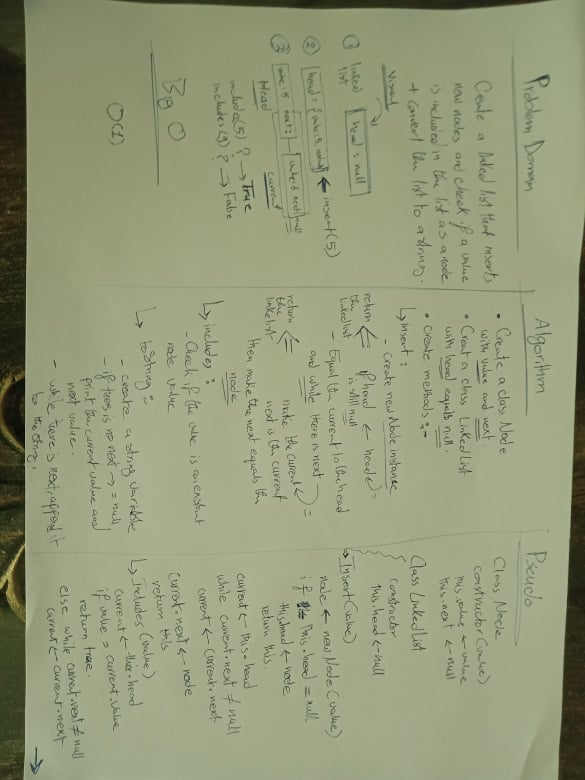
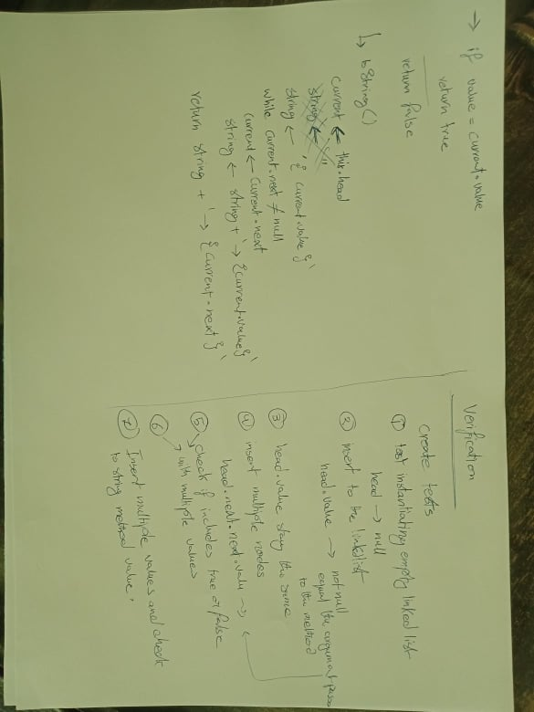
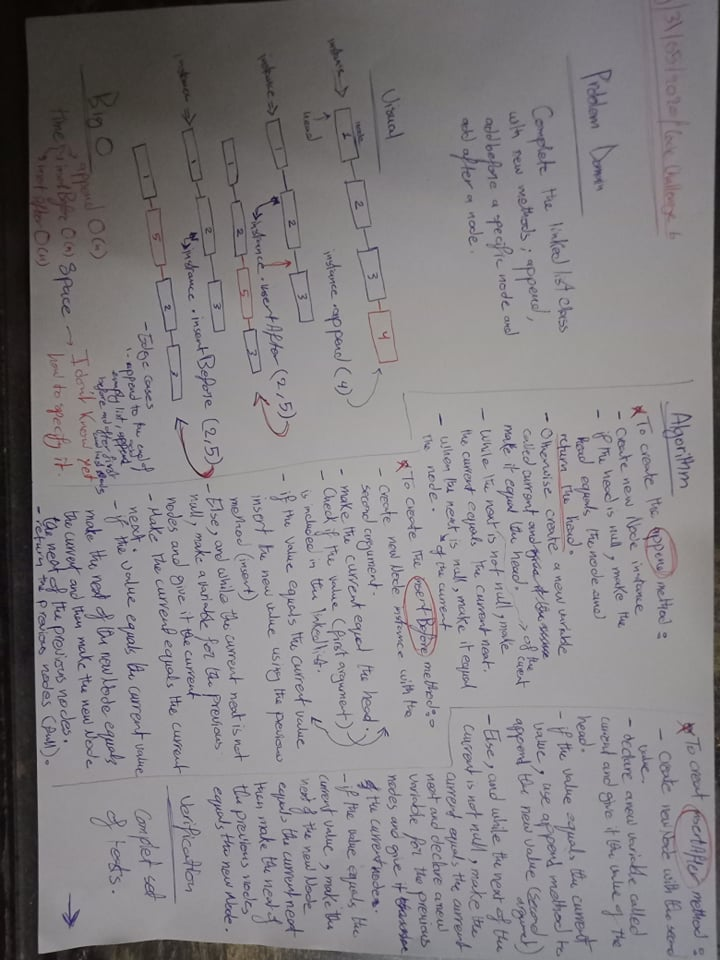
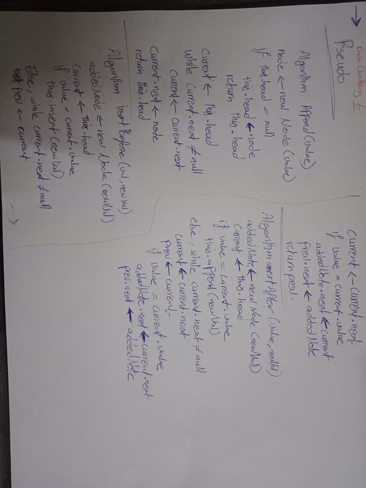

# Linked List Implementation and Insertion
Implement the linked list concept and insertion.

## Challenge

Create a singly list with these features:

**Features** 
 - A Node class that has properties for the **value** stored in the Node, and a pointer to the **next** Node.
 - Within the LinkedList class, there is a head property. Upon instantiation, an empty Linked List is created.
 - A method called insert that takes any value as an argument and adds a new node with that value to the head of the list with an O(1) Time performance.
 - A method called includes that takes any value as an argument and returns a boolean result depending on whether that value exists as a Node’s value somewhere within the list.
 - A method called toString which takes in no arguments and returns a string representing all the values in the Linked List, formatted as:
   `"{ a } -> { b } -> { c } -> NULL"`
 - A method called append(value) which adds a new node with the given value to the end of the list
 - A method called insertBefore(value, newVal) which add a new node with the given newValue immediately before the first value node.
 - A method called insertAfter(value, newVal) which add a new node with the given newValue immediately after the first value node.
 - Exceptions or errors that come from the code is semantic, capturable errors.

## Approach & Efficiency
Created the node then a singly link list with all required methods then tested if the methods work properly.

## Solution

## Link to code
[linked-list-code](./linked-list.js)