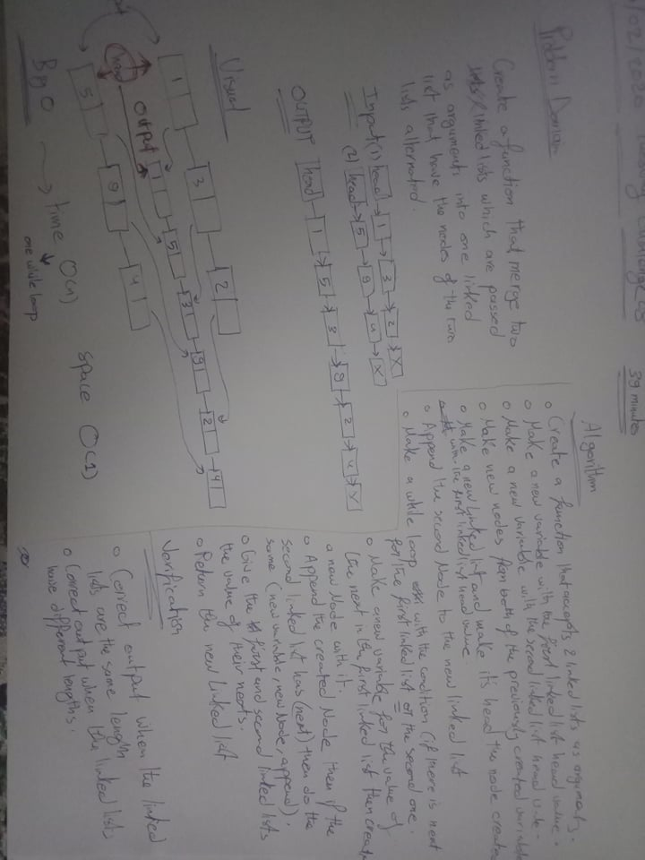
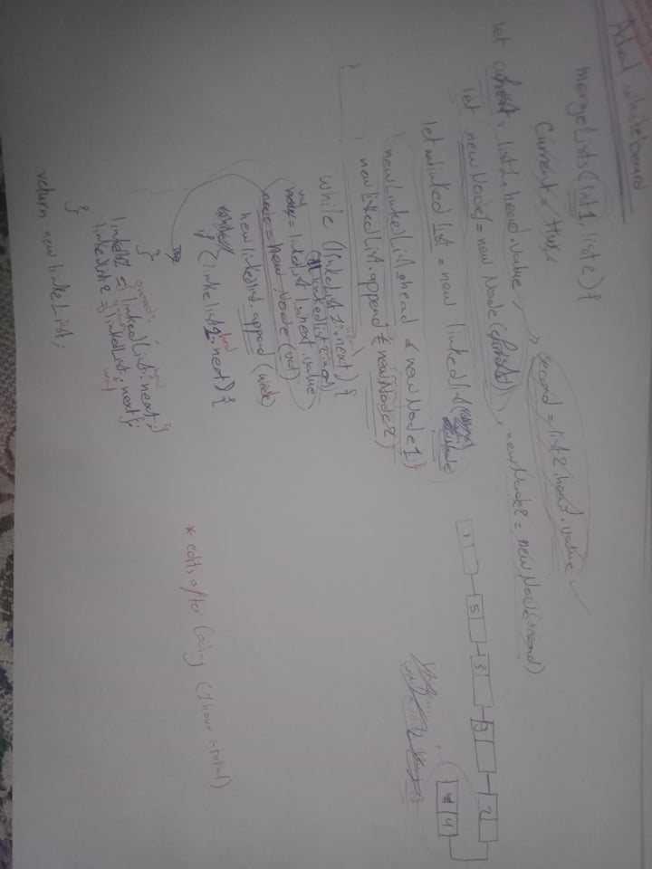

# Linked List Implementation and Insertion
Implement the linked list concept and insertion.

## Challenge

Create a singly list with these features:

**Features** 
 - A function called mergeLists which takes two linked lists as arguments. Zip the two linked lists together into one so that the nodes alternate between the two lists and return a reference to the head of the zipped list. 

## Approach & Efficiency
Created the node then a singly link list with all required methods then tested if the methods work properly.

## Solution

## Link to code
[linked-list-code](./ll-merge.js)