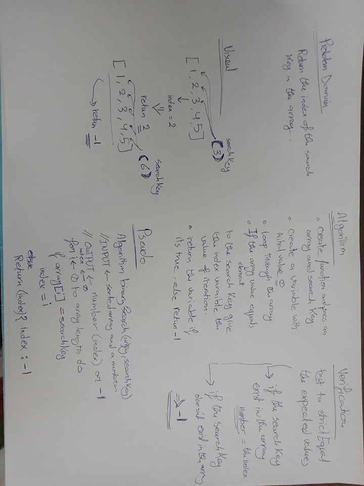

# Binary search an Array
Third code challenge in 401.

## Challenge
Search an array for the search key without using inbuilt methods and return the index if exists and -1 if not.

## Approach & Efficiency
I tried to make it simple and used a for loop with a turnery to return.

## Solution
