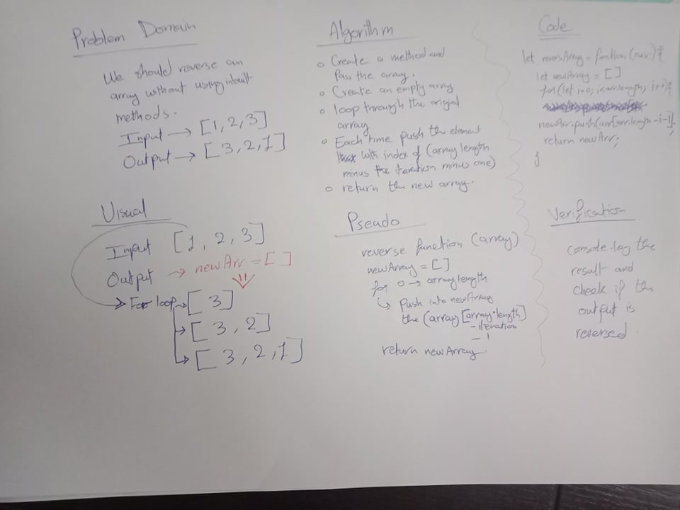

# Reverse an Array
First code challenge in 401.

## Challenge
Reverse an array without using inbuilt methods.

## Approach & Efficiency
I just made it simple and thought about how can I get the correct output without getting into too much steps so I used a new array and pushed each element to it the new order.

## Solution
