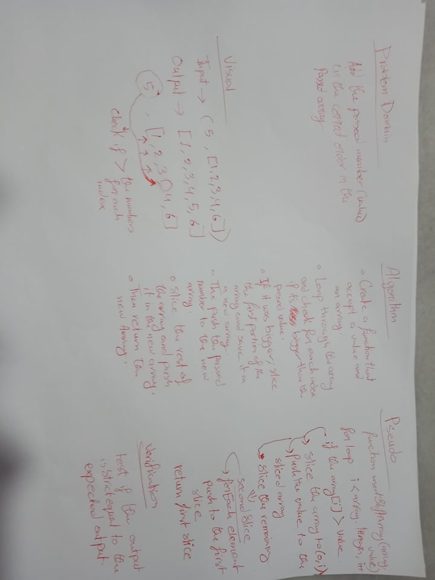

# Shift an Array
Second code challenge in 401.

## Challenge
Shift an array and add the passed number in the correct order inside the original array without using inbuilt methods.

## Approach & Efficiency
I divided the the array into two parts, numbers less than the passed number and bigger that it, then I compared it with the passed number and then push it to the first slice then passed each number in the second slice to the first slice.

## Solution
