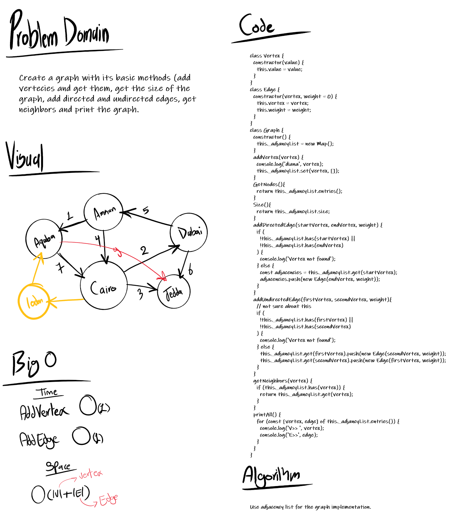

# Implementation: Graphs
Graphs implementation.

## Challenge

**Features**
- Implement a Graph. The graph represented as an adjacency list, and includes the following methods:

  * **AddNode()**: 
    - Adds a new node to the graph.
    - Takes in the value of that node.
    - Returns the added node.
  * **AddEdge()**:
    - Adds a new edge between two nodes in the graph.
    - Include the ability to have a “weight”.
    - Takes in the two nodes to be connected by the edge.
    - Both nodes already are in the Graph
  * **GetNodes()**: 
    - Returns all of the nodes in the graph as a collection (set, list, or similar)
  * **GetNeighbors()**:
    - Returns a collection of edges connected to the given node.
    - Takes in a given node.
    - Include the weight of the connection in the returned collection.
  * **Size()**: 
    - Returns the total number of nodes in the graph

**Structure and Testing**
- Utilize the Single-responsibility principle: any methods you write should be clean, reusable, abstract component parts to the whole challenge. You will be given feedback and marked down if you attempt to define a large, complex algorithm in one function definition.

- Tests proves the following functionality:
  * Node can be successfully added to the graph.
  * An edge can be successfully added to the graph.
  * A collection of all nodes can be properly retrieved from the graph.
  * All appropriate neighbors can be retrieved from the graph.
  * Neighbors are returned with the weight between nodes included.
  * The proper size is returned, representing the number of nodes in the graph.
  * A graph with only one node and edge can be properly returned.
  * An empty graph properly returns null.

## Solution

## Link to code
[graph](./graphs.js)
