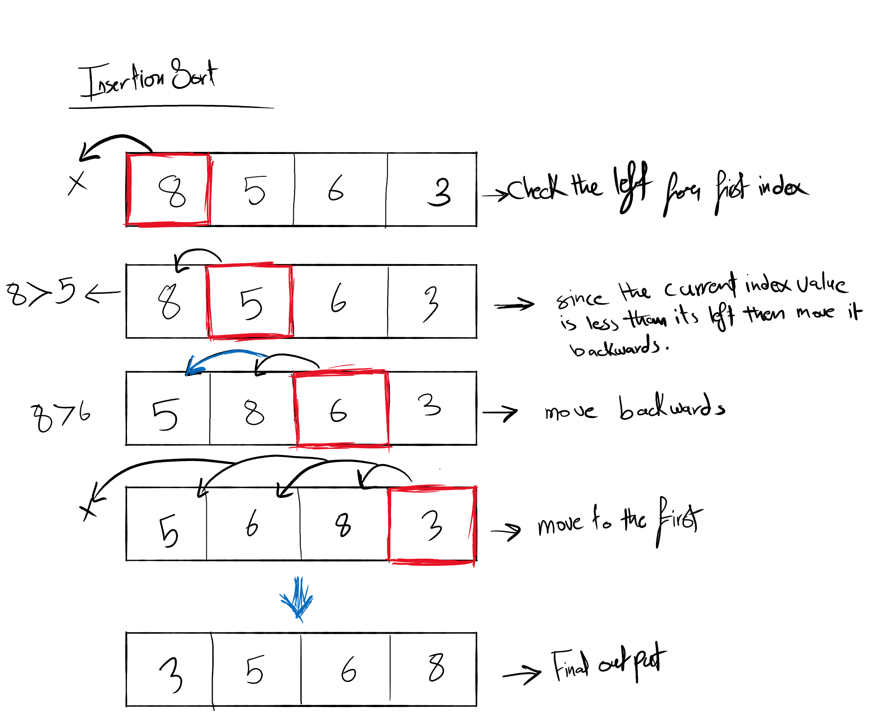

## Insertion sort

  - Array sorting:
    * Create a for loop that iterate the array with a starting `i = 1`.
    * Inside the for loop define two variables; one that will hold a temporary value for the first element to be compared with called `temp` and the other to hold its index aclled `j`.
    * Give the `j` variable the value of the iteration minus one.
    * Give the `temp` variable the value of the `i` index of the arr.
    * Create a while loop with the conditions of the `j` to be more than or equal `0` and the `temp` to be less than the array value of index `j` in order to compare and sort the two elements.
    * While the conditions are true; make the array value of index `j+1` equals to the array value of `j` (the previous index because its less than it).
    * After that, increment `j` by one.
    * Outside the while loop (when the temp value is grater than the array value of index `j` or `j` is less than 0) then give the array with index `j+1` the value of the temporary variable. 

  - Example: 
   
    * `arr = 4,8,23,42,16,15` , `i = 1` , `j = -1` ,`temp = 4`
    * `arr = 4,8,23,42,16,15` , `i = 2` , `j = 1`, `temp = 23`
    * `arr = 4,8,23,42,16,15` , `i = 3` , `j = 2`, `temp = 42`
    * `arr = 4,8,16,23,42,15` , `i = 4` , `j = 1`, `temp = 16`
    * `arr = 4,8,15,16,23,42` , `i = 5` , `j = 1`, `temp = 15`
