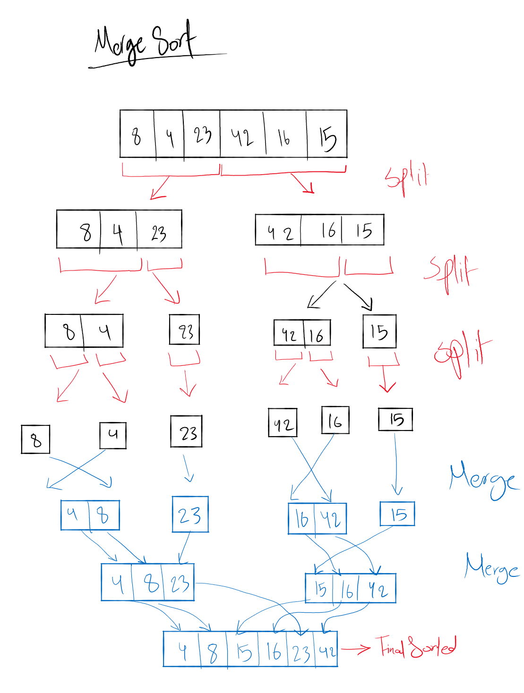

# Merge sort

- Merge Sort is a sorting algorithm, which is commonly used in computer science. 
- Merge Sort is a divide and conquer algorithm. It works by recursively breaking down a problem into two or more sub-problems of the same or related type, until these become simple enough to be solved directly. The solutions to the sub-problems are then combined to give a solution to the original problem. 
- So Merge Sort first divides the array into equal halves and then combines them in a sorted manner.

#### Example: 
arr = [8,4,23,42,16,15]

