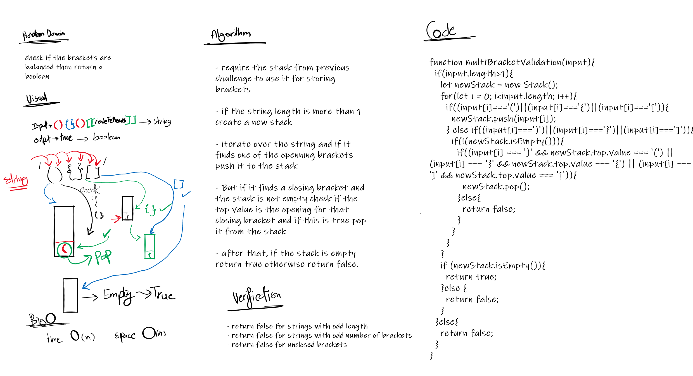

# Multi bracket validation
Multi Bracket validation.

## Challenge

Your function should take a string as its only argument, and should return a boolean representing whether or not the brackets in the string are balanced. There are 3 types of brackets:

 - Round Brackets : `()`
 - Square Brackets : `[]`
 - Curly Brackets : `{}`

## Approach & Efficiency
Acually my solution is not efficient but I'm planning to try to use stacks to at least get big O(n)

## Solution

## Link to code
[multi-bracket-validation](./multi-bracket-validation.js)
