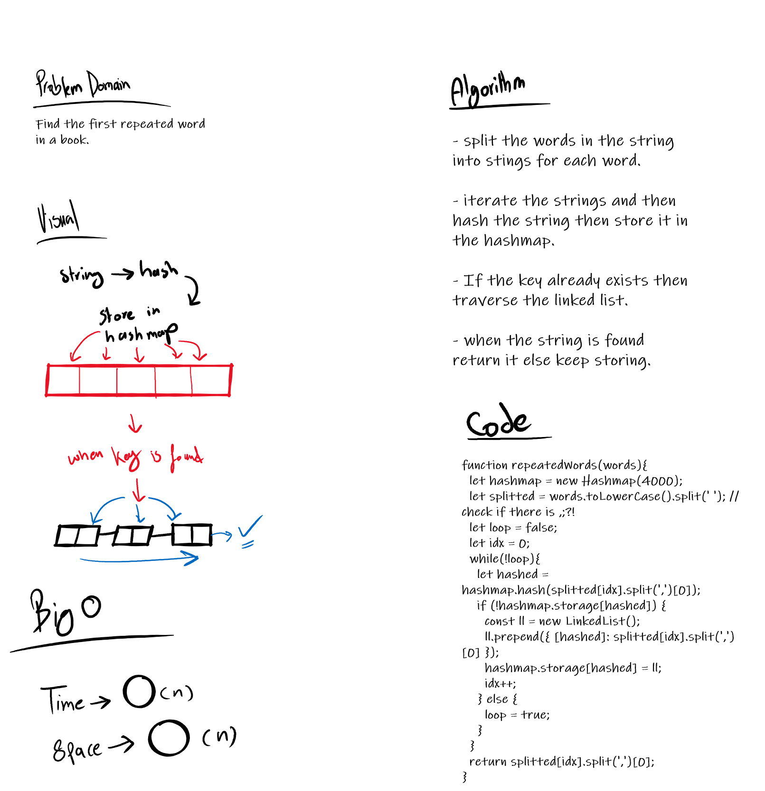

# Implementation: Hash Tables
Find the first repeated word in a book.

## Challenge

**Features**
- Write a function that accepts a lengthy string parameter.
- Without utilizing any of the built-in library methods available to your language, return the first word to occur more than once in that provided string.

**Structure and Testing**
- Utilize the Single-responsibility principle: any methods you write should be clean, reusable, abstract component parts to the whole challenge. You will be given feedback and marked down if you attempt to define a large, complex algorithm in one function definition.

## Solution

## Link to code
[Repeated word](./repeated-word.js)
