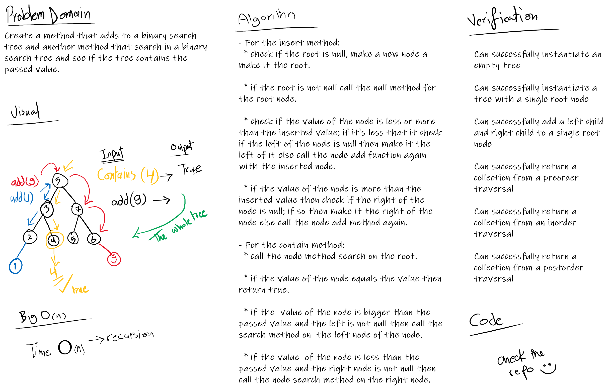
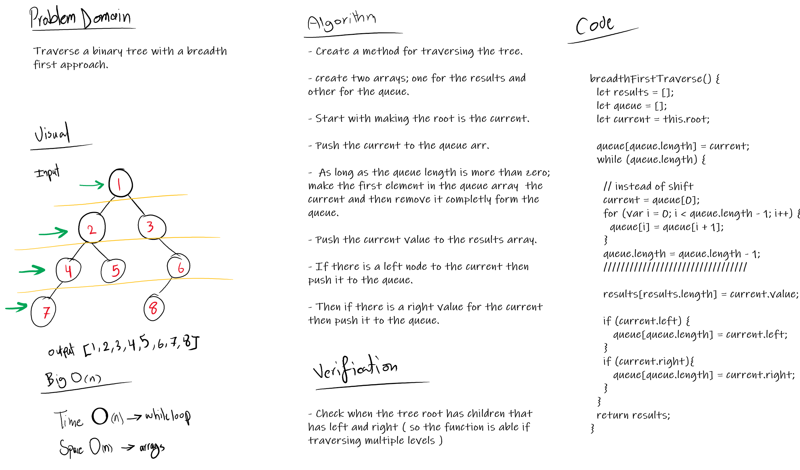
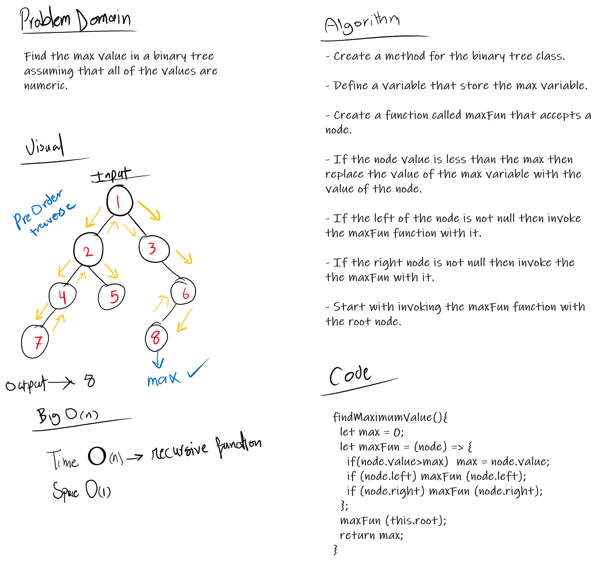

# Trees
Implement the tree data structure concept.

## Challenge

**Features**
  - A Node class that has properties for the value stored in the node, the left child node, and the right child node.
    * A BinaryTree class that has:
      * A method for each of the depth first traversals called **preOrder**, **inOrder**, and **postOrder** which returns an array of the values, ordered appropriately.

 - A BinarySearchTree class that has:
   * A method named add that accepts a value, and adds a new node with that value in the correct location in the binary search tree.
   * A method named contains that accepts a value, and returns a boolean indicating whether or not the value is in the tree at least once.

- A breadth first traversal method which takes a Binary Tree as its unique input. Without utilizing any of the built-in methods available in JS. It traverses the input tree using a Breadth-first approach, and return a list of the values in the tree in the order they were encountered.

- An instance method called find-maximum-value. Without utilizing any of the built-in methods available to your language, return the maximum value stored in the tree. Assuming that the values stored in the Binary Tree will be numeric.

## Solution

Basic

Breadth first method

Find Max value 

## Link to code
[tree-1](./tree.js)
