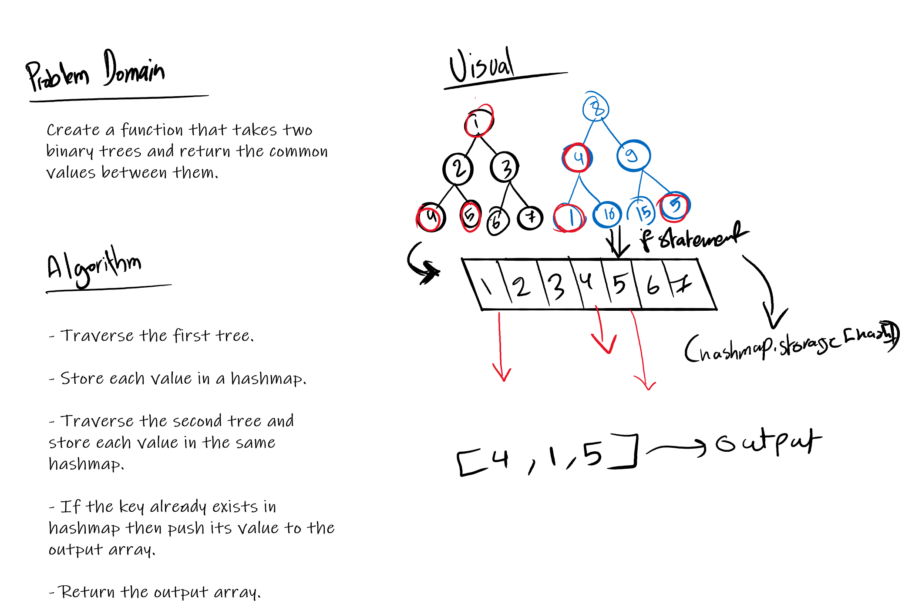

# Trees
 Compare two binary trees and return a set of values found in both trees.
## Challenge

**Features**
  - **Feature Tasks**
   A function called tree_intersection that takes two binary tree parameters.
  - Without utilizing any of the built-in library methods available to your language, return a set of values found in both trees.

**Structure and Testing**
- Utilize the Single-responsibility principle: any methods you write should be clean, reusable, abstract component parts to the whole challenge. You will be given feedback and marked down if you attempt to define a large, complex algorithm in one function definition.

Write at least three test assertions for each method that you define.

## Solution

## Link to code
[tree-intersection](./tree-intersection.js)
